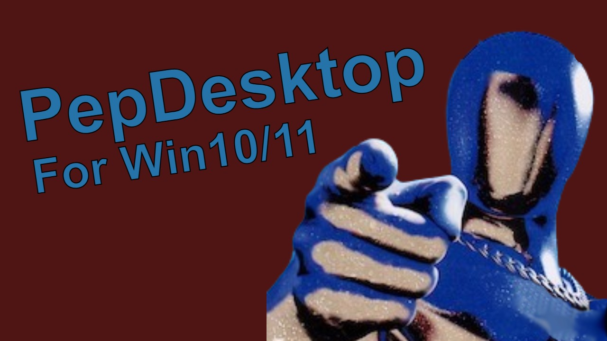

# PepDesktop



PepDesktop revives the original 1997 *Desktop Character Pepsiman* mascot for modern Windows 10/11 (64-bit).

## Legal Notice

You **must own the original CD-ROM** to use this project. No game files or copyrighted assets are included in this repository. This project provides only patching tools and launcher code — you supply the original `dc_pepsi.exe` from your legally purchased copy.

## Prerequisites

- **MinGW-w64 (GCC)** — to compile the C launcher and hook DLL
- **Python 3** — to run the binary patcher and asset extractor
- The **original Pepsiman CD-ROM** (or its extracted installer files)

## Quick Start

1. **Obtain Pepsiman** — install from the original CD-ROM (1997), or extract `Data.z` using `extract_pepsi.py`.
2. **Copy `dc_pepsi.exe`** from the installation directory into this repository root.
3. **Patch the binary:**
   ```bash
   python make_portable.py
   ```
4. **Extract assets** (if needed):
   ```bash
   python extract_pepsi.py <path_to_Data.z> [output_dir]
   ```
5. **Build the launcher:**
   ```bash
   gcc launcher.c -o PlayPepsiman.exe -luser32 -lgdi32
   ```
6. **Build the hook DLL (32-bit):**
   ```bash
   gcc PepsimanHook.c -shared -o PepsimanHook.dll -luser32 -lgdi32 -static-libgcc -m32
   ```
7. **Build the launcher (32-bit):**
   ```bash
   gcc PlayPepsiman.c -o PlayPepsiman2.exe -luser32 -lkernel32 -static-libgcc -m32
   ```
8. **Run `PlayPepsiman2.exe`** in the directory containing `dc_pepsi.exe`, `PepsimanHook.dll`, and the `pepsiman/` asset folder.

> **Note:** The hook DLL and launcher must be **32-bit** (`-m32` flag) because the original game is a 32-bit application. A 64-bit DLL cannot be injected into a 32-bit process.

## Alternative: Pre-built Portable Package

The `Portable_Pepsiman/` directory contains a fully pre-patched, ready-to-run deployment:

| File | Purpose |
|------|---------|
| `dc_pepsi.exe` | Patched original binary |
| `PlayPepsiman2.exe` | **32-bit launcher + DLL injector** (recommended) |
| `PlayPepsiman.exe` | 64-bit launcher (requires separate 32-bit injector) |
| `PepsimanHook.dll` | Chroma-key + frame clearing hook DLL (32-bit) |
| `Injector.exe` | Standalone DLL injector |
| `dc_pep.tbd` | Animation database config |
| `pepsiman/` | Extracted game assets (`.bac`, `.mot`, `.TRA`, textures) |

**To use:** run `PlayPepsiman2.exe` from inside `Portable_Pepsiman/`.

## How It Works

### The Hook DLL (`PepsimanHook.dll`)

The original Pepsiman mascot renders itself using two BitBlt operations per frame — `SRCAND` (mask) followed by `SRCPAINT` (sprite) — to produce transparency. On modern Windows with DWM compositing, the desktop background behind the window is no longer readable, causing the character to render over a black void.

The hook uses two techniques:

1. **Chroma-key transparency** — the game window is set to `WS_EX_LAYERED` with black (`RGB(0,0,0)`) as the color key. Pure black pixels become transparent, revealing the desktop behind. This eliminates the black rectangle.

2. **Frame clearing** — the `BitBlt` Import Address Table is patched to intercept `SRCAND` operations. Before each frame's mask is drawn, the draw area is filled with black. This clears residual pixels from the previous frame, preventing visual ghosting/smearing when the character moves. A 500ms backup clear handles edge cases where alternative raster ops are used.

### The Binary Patcher (`make_portable.py`)

Three byte-level patches to `dc_pepsi.exe`:

- **Crash fix** at `0x1160` — adds a null-pointer guard before an indirect call.
- **Popup suppression** at `0xEFD7` — changes a conditional jump to an unconditional jump, silencing the "sorry, some errors occured" dialog.
- **Portability hack** at `0x52B0C` — redirects the config path from `C:\Windows\dc_pepsi.ini` to `.\dc_pep.tbd`.

### The Launcher (`launcher.c`)

Resolves its own directory, writes a `dc_pep.tbd` config file with absolute paths to the `pepsiman/` folder, sets the `~ 16BITCOLOR` Windows compatibility flag to fix rendering artifacts, and launches `dc_pepsi.exe`.

## Project Structure

| Path | Purpose |
|------|---------|
| `launcher.c` | C launcher — writes config, sets compat flags, launches the game |
| `PepsimanHook.c` | BitBlt hook DLL — composites mascot over modern desktop |
| `PlayPepsiman.c` | Launcher with CreateRemoteThread DLL injection |
| `pepsi_hook.c` | Alternative hook using MinHook (GetDC/ReleaseDC + green screen key) |
| `Injector.c` | Standalone DLL injector (CreateProcess suspended) |
| `ScreenCapServer.c` | Shared-memory desktop capture server |
| `make_portable.py` | Binary patcher for `dc_pepsi.exe` |
| `extract_pepsi.py` | Asset extractor from original CD installer |
| `launcher.cs` | C# launcher (older approach) |
| `winmm.def` | WinMM DLL proxy module definition |
| `winmm_names.txt` | WinMM export name list (documentation) |
| `winmm_exports.txt` | WinMM export ordinal map (documentation) |
| `tools/` | Debug utilities (`FindWindow.cs`, `ListWindows.cs`) |
| `minhook/` | Vendored MinHook library (submodule) |
| `Portable_Pepsiman/` | Pre-built portable deployment |

## Build Instructions

### Pepsiman Hook DLL (32-bit)
```bash
gcc PepsimanHook.c -shared -o PepsimanHook.dll -luser32 -lgdi32 -static-libgcc -O2 -m32
```

### PlayPepsiman2 (32-bit launcher + injector)
```bash
gcc PlayPepsiman.c -o PlayPepsiman2.exe -luser32 -lkernel32 -static-libgcc -O2 -m32
```

> **Important:** Both the DLL and injector must be compiled as **32-bit** (`-m32`). 
> The original game is a 32-bit PE executable and will reject a 64-bit DLL injection.

### Injector (standalone DLL injector)
```bash
gcc Injector.c -o Injector.exe -luser32 -lkernel32
```

### pepsi_hook (MinHook alternative)
```bash
gcc pepsi_hook.c -shared -o pepsi_hook.dll -Iminhook/include -Lminhook/build -lminhook -static-libgcc
```

### ScreenCapServer
```bash
gcc ScreenCapServer.c -o ScreenCapServer.exe -lgdi32 -luser32
```

## Status

| Feature | Status |
|---------|--------|
| Black background behind character | ✅ Fixed (chroma-key) |
| Smearing/ghosting during movement | ✅ Mostly fixed (minor edge smears remain) |
| Character walks left/right | ✅ Works |
| Resize buttons (small/big) | ✅ Works |
| Emote/animation buttons | ❌ Crashes (game code bug on modern Windows) |
| Middle size button | ❌ Crashes |
| Flickering | ✅ None |

The emote button crashes are a compatibility issue in the original `dc_pepsi.exe` (null pointer dereference in animation loading code at address `0x45766E`). This is a bug in the 1997 game itself, not the hook DLL — it occurs with or without the hook loaded.

## Credits

- Resurrected by **Antigravity** (Google DeepMind)
- Original application by **HIcorp** (1997)
- [MinHook](https://github.com/TsudaKageyu/minhook) library by TsudaKageyu
